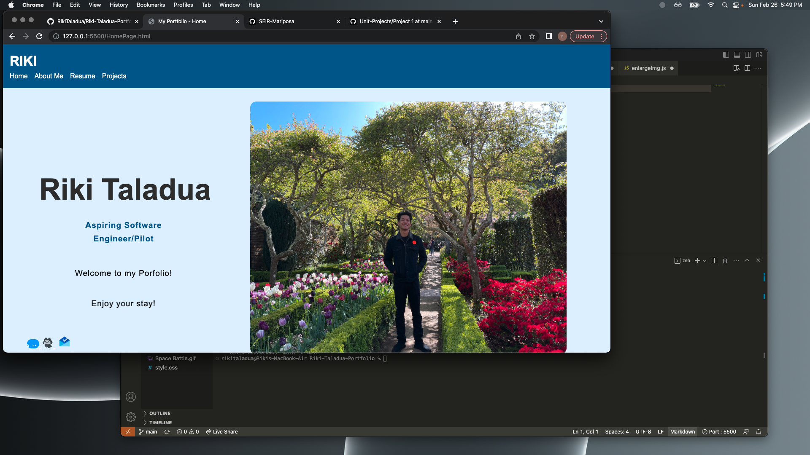
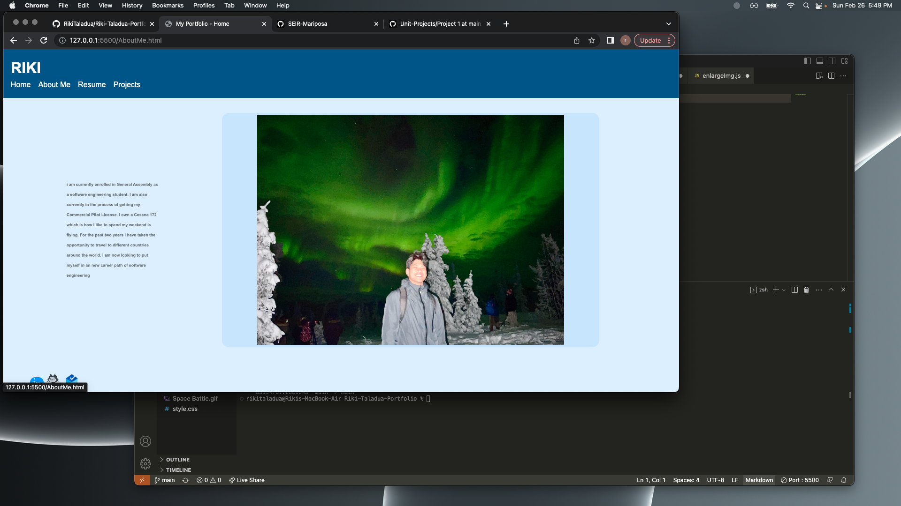
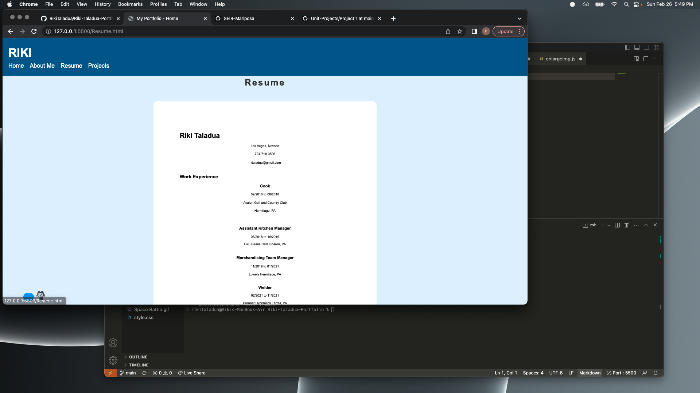
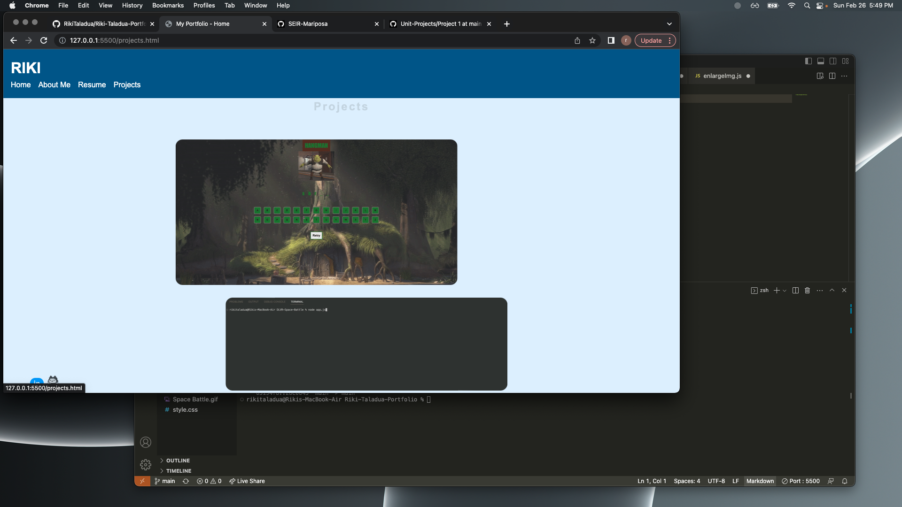

# Riki-Taladua-Portfolio
## Hompage Screenshot

## AboutMe Screenshot

## Resume Page Screenshot 

## Projects Page Screenshot

## List Of Technologies
 1. JavaScript
 1. CSS
 1. HTML

## Installation Instruction
### View on Google Chrome Browser

## User Stories 
1. As a software engineering student, I want to be able to troubleshoot more efficiently, so that I can fix any errors as fast and efficient as possible.

1. As a student at GA, I want my end goal to be somewhat fluent in coding, so that I can look at anyone's code and be able to understand what the code is for and its functions.

1. As a friend of the person who built this portfolio, I want to see what my friend has built so that I have an understanding of what they do as a developer and I can encourage them.

# Wireframes

